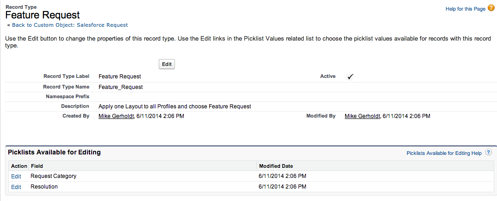
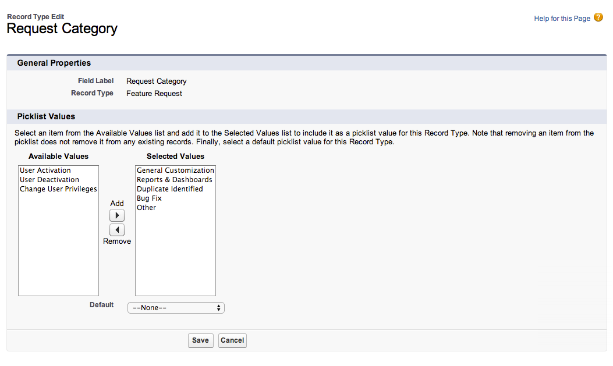
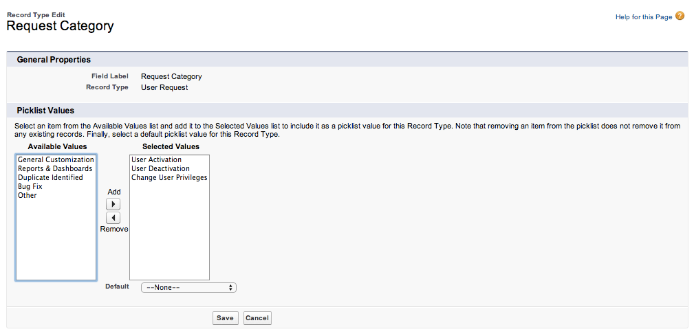

#Module 5: Adding Record Types 

In the previous exercise you created Page Layouts to give the user a great experience logging the Salesforce request by only serving up relevant fields. In this exercise we want to map those Page Layouts to Record Types so that the user can select either User Requests or Feature Requests and see the correct Page Layout and Record Type. This will meet our business requirement by allowing us to report on User Requests versus Feature Requests.

### Add a User Request Record Type

1. On the Salesforce Request Custom Object, scroll down to the Record Types section and click the **New** button.

2. For Record Type Label enter `User Request`

3. For Description enter `Use for User Activation Requests or User Deactivations`

4. Make sure the **Active** box is checked and click **Next**

5. Keep the radio button on the `Apply one Layout to all Profiles` and choose `User Request` from the picklist.

6. Then click **Save & New** to add a second Record Type.

### Add a Feature Request Record Type

You should already be in the New Record Type wizard, so you can create the Feature Request Record Type in the same manner.

1. For Record Type Label enter `Feature Request`

2. For Description enter `Use for Feature Requests, Bug Fixes, and Report/Dashboard Requests`

3. Make sure the **Active** box is checked and enable it for all profiles

4. Click the top **Enable for Profile** to enable this record type for all profiles. (By enabling a Record Type for a profile, anyone with that profile can use it.)

5. Then click **Next**

6. Keep the radio button on the `Apply one Layout to all Profiles` and choose Feature Request from the picklist.

7. Then click Save to add that Record Type.

Another benefit of adding Record Types is that now we can limit the picklist values based on the Record Type the user selects. In the following exercise we will edit the Request Category picklist value for the Feature Request Record Type we just created.

1. Next to Request Category click Edit.

2. Select User Activation, User Deactivation and Change User Privileges and move them to the Available Values column by clicking the Remove button.

3. Then Click **Save**.

Repeat the same process for the User Request Record Type having only the User Activation, User Deactivation, and Change User Privileges as selected values.

Remember the **Remove** button will move highlighted values from the **Selected Values** column to the **Available Values** column. The **Add** button will move highlighted values from the **Available Values** Column to the **Selected Values** column. 

## Try out the App
Click the New button and fill out a Salesforce Request. How is the experience different now that we added Record Types and Page Layouts? What are some ways we can automate and add logic to this app?

